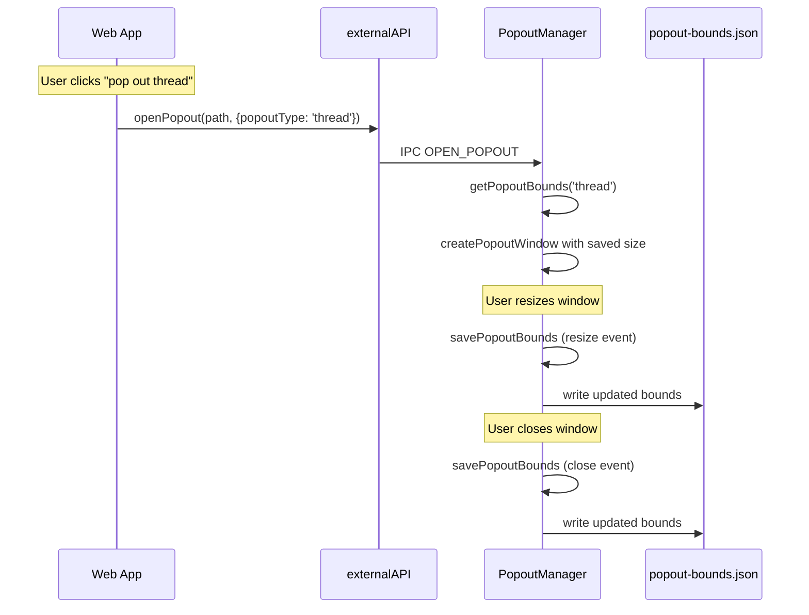

# Popout Window Size Persistence

## Current state

- Popout windows are created in `[PopoutManager.createPopoutWindow()](src/app/windows/popoutManager.ts)` with hardcoded defaults: 1280x800 for regular popouts, 800xMainHeight for RHS popouts.
- The web app calls `desktopAPI.openPopout(path, props)` where `PopoutViewProps` currently only has `titleTemplate` and `isRHS`.
- The main window persists its bounds to `bounds-info.json` using `fs.readFileSync`/`writeFileSync` in `[MainWindow](src/app/mainWindow/mainWindow.ts)`.
- Full Mattermost windows are created via `handleCreateNewWindow` with no props at all.

## Approach: Separate `popout-bounds.json` file

Use a **new file** rather than extending `bounds-info.json`. Reasons:

- The existing `boundsInfoSchema` uses `stripUnknown: true` and stores a flat `SavedWindowState`. Changing its shape would require a migration and affect the main window restore logic.
- Popout bounds are conceptually different (keyed by type, no position/maximized/fullscreen).
- A separate file keeps concerns isolated and avoids any risk to the existing main window bounds logic.

### Data structure

```typescript
// popout-bounds.json
{
  "thread": { "width": 900, "height": 700 },
  "playbooks": { "width": 1100, "height": 800 },
  "_full_window": { "width": 1280, "height": 800 }
}
```

Keys are the `popoutType` string from the web app. The file only contains entries for popout types the user has actually resized -- if no entry exists for a type, the hardcoded defaults are used.

Reserved key: `_full_window` -- for full Mattermost windows (created via `CREATE_NEW_WINDOW`).

Popouts with no `popoutType` provided by the web app do not get their bounds persisted (they always use defaults).

## Changes

### 1. Extend `PopoutViewProps` in the API types

**File: [api-types/index.ts](api-types/index.ts)**

Add `popoutType?: string` to `PopoutViewProps`:

```typescript
export type PopoutViewProps = {
    titleTemplate?: string;
    isRHS?: boolean;
    popoutType?: string;
};
```

### 2. Register `popoutType` as a supported popout option

**File: [src/app/windows/popoutManager.ts](src/app/windows/popoutManager.ts)**

Add `'popoutType'` to the `handleCanUsePopoutOption` switch so the web app knows the desktop app supports it:

```typescript
case 'titleTemplate':
case 'isRHS':
case 'popoutType':
    return true;
```

### 3. Add the new file path

**File: [src/main/constants.ts](src/main/constants.ts)**

Add `popoutBoundsPath` alongside the existing path constants:

```typescript
export let popoutBoundsPath = '';
// ... in updatePaths():
popoutBoundsPath = path.join(userDataPath, 'popout-bounds.json');
```

### 4. Add bounds persistence to `PopoutManager`

**File: [src/app/windows/popoutManager.ts](src/app/windows/popoutManager.ts)**

Add bounds management directly to the existing `PopoutManager` class (no separate manager needed):

- **New property**: `popoutBounds: Record<string, { width: number; height: number }>` -- in-memory cache loaded from disk on construction
- `**loadPopoutBounds()`** -- reads `popout-bounds.json` via `fs.readFileSync`, validates with `Validator.validatePopoutBounds()`, falls back to `{}` on error
- `**getPopoutBounds(popoutType)`** -- returns saved `{ width, height }` from the cache, or `undefined` if no entry
- `**savePopoutBounds(viewId)`** -- resolves the type key from the view's props, gets current `window.getSize()`, updates the cache and writes to disk via `fs.writeFileSync`
- `**getPopoutTypeKey(view)`** -- returns `view.props?.popoutType`, or `'_full_window'` for full windows, or `undefined` if no type is set (meaning bounds won't be persisted)

### 5. Add Joi validation

**File: [src/common/Validator.ts](src/common/Validator.ts)**

Add a schema and validation function for the popout bounds data:

```typescript
const popoutBoundsEntrySchema = Joi.object({
    width: Joi.number().integer().min(minWindowWidth).required(),
    height: Joi.number().integer().min(minWindowHeight).required(),
});

const popoutBoundsSchema = Joi.object().pattern(
    Joi.string(),
    popoutBoundsEntrySchema,
);

export function validatePopoutBounds(data: Record<string, {width: number; height: number}>) {
    return validateAgainstSchema(data, popoutBoundsSchema);
}
```

### 6. Restore bounds in `createPopoutWindow`

**File: [src/app/windows/popoutManager.ts](src/app/windows/popoutManager.ts)**

Modify `createPopoutWindow()` to look up saved dimensions:

```
createPopoutWindow(view):
  1. Determine the type key via getPopoutTypeKey(view)
  2. If type key exists, look up saved bounds via getPopoutBounds(typeKey)
  3. If isRHS: use saved width (fallback DEFAULT_RHS_WINDOW_WIDTH), height from main window
  4. Otherwise: use saved width/height if available (fallback to BaseWindow defaults)
  5. Pass the resolved options to new BaseWindow(options)
```

### 7. Save bounds on resize, blur, and close

**File: [src/app/windows/popoutManager.ts](src/app/windows/popoutManager.ts)**

Add save logic in `setupView()`:

- Add a `resize` listener on `BrowserWindow` that calls `savePopoutBounds(viewId)` -- captures the new size as the user drags
- Add a `blur` listener on `BrowserWindow` that calls `savePopoutBounds(viewId)` -- catches any final state when focus leaves
- In the existing `close` handler (`onClosePopout`), call `savePopoutBounds(viewId)` before cleanup
- `savePopoutBounds(viewId)` resolves the type key from the view's props; if no type key (untyped popout), it no-ops. Otherwise writes current `window.getSize()` to the in-memory cache and persists to disk
- All three listeners are cleaned up in the teardown function stored in `popoutListeners`

### 8. Pass `popoutType` through for full windows

**File: [src/app/windows/popoutManager.ts](src/app/windows/popoutManager.ts)**

In `handleCreateNewWindow`, pass `{ popoutType: '_full_window' }` as props when calling `ViewManager.createView()` so the type key is available on the view.

## Flow diagram




## Testing considerations

- Unit test `PopoutManager` bounds methods -- load, save, get, type key resolution
- Unit test `createPopoutWindow` -- verify saved bounds are applied, fallback to defaults when no saved bounds exist
- Unit test `handleCanUsePopoutOption` -- `'popoutType'` returns `true`
- Verify first-launch behavior when `popout-bounds.json` doesn't exist (uses hardcoded defaults)
- Verify corrupt file is handled gracefully (falls back to defaults)
- Verify untyped popouts (no `popoutType`) never write to the bounds file

