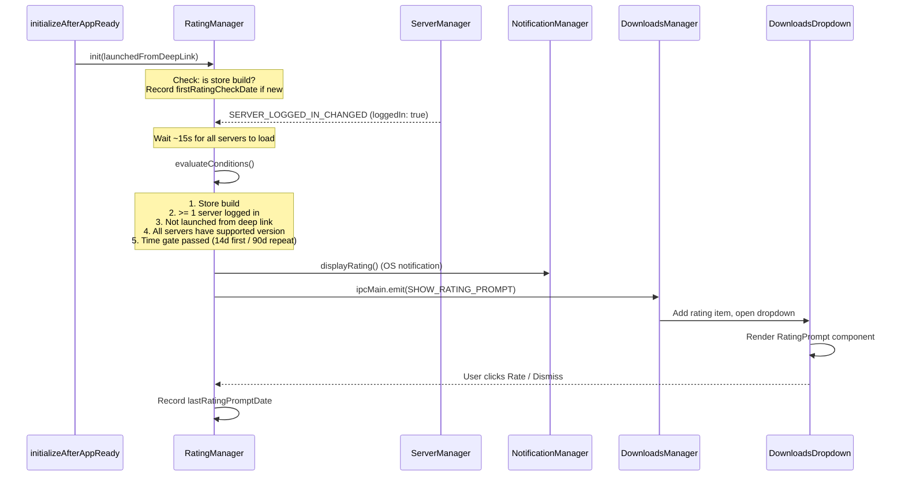

# Store Rating Prompt

## Store Build Detection

We use **compile-time flags** (`__IS_MAC_APP_STORE__` and a new `__IS_WINDOWS_STORE__`) rather than Electron's runtime properties (`process.mas` / `process.windowsStore`) to detect store builds. The reasoning:

- **Windows Store builds use the same MSI** that ships on GitHub. The release team uploads it to the Microsoft Store manually. Because it's an MSI (not an APPX/MSIX), Electron's `process.windowsStore` is `false` at runtime. A compile-time flag gives us reliable detection regardless of how Microsoft packages or distributes the installer.
- **Consistent with existing pattern.** `__IS_MAC_APP_STORE__` already exists and is set via the `IS_MAC_APP_STORE` env var in the MAS build pipeline. Adding `__IS_WINDOWS_STORE__` via `IS_WINDOWS_STORE` follows the same mechanism.
- **Easy to migrate later.** The rating manager calls a single `isStoreBuild()` helper. If the team later adopts native APPX packaging (making `process.windowsStore` available), the implementation can switch without changing any callers.

### Changes for `__IS_WINDOWS_STORE__`

- `[webpack.config.base.js](webpack.config.base.js)` — Add `__IS_WINDOWS_STORE__: JSON.stringify(process.env.IS_WINDOWS_STORE === 'true')` to `codeDefinitions`
- `[package.json](package.json)` — Add `__IS_WINDOWS_STORE__: false` to Jest `globals`
- TypeScript global declaration (wherever `__IS_MAC_APP_STORE__` is declared, or add alongside `@ts-ignore` usages)

The release team then sets `IS_WINDOWS_STORE=true` in the Windows Store build pipeline.

## Architecture

The feature follows the same dual-notification pattern as auto-updates: an OS-level notification (via `NotificationManager`) plus an in-app item in the downloads dropdown. A new `RatingManager` singleton under `src/main/notifications/` evaluates conditions on cold start and triggers both.

This mirrors how `updateNotifier.ts` calls both `NotificationManager.displayUpgrade()` (OS notification) and emits `UPDATE_AVAILABLE` (downloads dropdown item). The rating prompt uses the same two channels.

## Condition Details

- **Store build**: `__IS_MAC_APP_STORE__` or `__IS_WINDOWS_STORE__` (compile-time flags set in store build pipelines). Also reject `electronIsDev`.
- **Logged in**: `ServerManager.getAllServers().some(s => s.isLoggedIn)`.
- **Not deep link launch**: Track whether `getDeeplinkingURL()` found a URL during this cold start via a flag passed to `RatingManager.init()`.
- **Supported server versions**: All servers with remote info must have `serverVersion >= buildConfig.minimumServerVersionForRating`. Servers without version info are treated as unsupported.
- **Time gates**: First-ever prompt requires 14 days since `firstRatingCheckDate`. Subsequent prompts require 90 days since `lastRatingPromptDate`. Both "Rate" and "Dismiss" actions record the date (resetting the 90-day timer).

## Store Links

Reuse existing `buildConfig` URLs:

- macOS: `buildConfig.macAppStoreUpdateURL` (`macappstore://apps.apple.com/...`)
- Windows: `buildConfig.windowsStoreUpdateURL` (`ms-windows-store://pdp/...`)

## Files to Create

### `src/main/notifications/Rating.ts`

New OS notification class following the same pattern as `[src/main/notifications/Upgrade.ts](src/main/notifications/Upgrade.ts)`:

- `RatingNotification extends Notification` with title "Enjoying Mattermost?" and body "Tap to rate us in the store"
- Platform-specific icon handling (same as `NewVersionNotification`)
- Clicking the notification opens the appropriate store link

### `src/main/notifications/ratingManager.ts`

New singleton module under `src/main/notifications/`. Handles all rating prompt logic:

- `init(launchedFromDeepLink: boolean)` called from `initializeAfterAppReady`
- `isStoreBuild()` checks `__IS_MAC_APP_STORE__` or `__IS_WINDOWS_STORE__`, rejects `electronIsDev`
- Listens for `SERVER_LOGGED_IN_CHANGED`, debounces 15 seconds, then evaluates all conditions
- Records `firstRatingCheckDate` on first run via `AppVersionManager`
- Calls `NotificationManager.displayRating()` to show OS notification
- Emits `SHOW_RATING_PROMPT` to trigger the downloads dropdown item
- Registers IPC handlers: `DISMISS_RATING_PROMPT` (records date, removes item), `OPEN_STORE_RATING` (opens store link, records date, removes item)

### `src/renderer/components/DownloadsDropdown/RatingPrompt/RatingPrompt.tsx`

New React component rendered in the downloads dropdown. Similar layout to `[src/renderer/components/DownloadsDropdown/Update/UpdateAvailable.tsx](src/renderer/components/DownloadsDropdown/Update/UpdateAvailable.tsx)`:

- Title: "Enjoying Mattermost?"
- Description: "Rate us on the [Mac App Store / Microsoft Store]"
- Primary button: "Rate in Store" (calls `window.desktop.openStoreRating()`)
- Secondary link: "Not now" (calls `window.desktop.dismissRatingPrompt()`)

### `src/renderer/components/DownloadsDropdown/RatingPrompt/RatingPrompt.scss`

Styles matching the existing `DownloadsDropdown__Update` pattern.

## Files to Modify

### Types and Config

- `[src/types/config.ts](src/types/config.ts)` — Add `minimumServerVersionForRating?: string` to `BuildConfig`
- `[src/common/config/buildConfig.ts](src/common/config/buildConfig.ts)` — Set default `minimumServerVersionForRating` (e.g., `'10.11.0'` for current ESR)
- `[src/types/appState.ts](src/types/appState.ts)` — Add `lastRatingPromptDate?: string` and `firstRatingCheckDate?: string`
- `[src/common/Validator.ts](src/common/Validator.ts)` — Add `lastRatingPromptDate: Joi.string()` and `firstRatingCheckDate: Joi.string()` to `appStateSchema`
- `[src/main/AppVersionManager.ts](src/main/AppVersionManager.ts)` — Add getter/setter pairs for both new date fields (same pattern as `updateCheckedDate`)

### Build System

- `[webpack.config.base.js](webpack.config.base.js)` — Add `__IS_WINDOWS_STORE__` to `codeDefinitions`
- `[package.json](package.json)` — Add `__IS_WINDOWS_STORE__` to Jest `globals`

### Notifications

- `[src/main/notifications/index.ts](src/main/notifications/index.ts)` — Import `RatingNotification` from `Rating.ts`, add `displayRating(handleRate: () => void)` method to `NotificationManager` (same pattern as `displayUpgrade`)

### IPC and Preload

- `[src/common/communication.ts](src/common/communication.ts)` — Add `SHOW_RATING_PROMPT`, `DISMISS_RATING_PROMPT`, `OPEN_STORE_RATING`
- `[src/app/preload/internalAPI.js](src/app/preload/internalAPI.js)` — Expose `openStoreRating` and `dismissRatingPrompt` via `window.desktop`
- `[src/types/window.ts](src/types/window.ts)` — Add `openStoreRating()` and `dismissRatingPrompt()` to the desktop API type

### Downloads Integration

- `[src/types/downloads.ts](src/types/downloads.ts)` — Add `RATING = 'rating'` to `DownloadItemTypeEnum`
- `[src/common/constants.ts](src/common/constants.ts)` — Add `APP_RATING_KEY` and `RATING_DOWNLOAD_ITEM` constants (same pattern as `APP_UPDATE_KEY` / `UPDATE_DOWNLOAD_ITEM`)
- `[src/main/downloadsManager.ts](src/main/downloadsManager.ts)` — Listen for `SHOW_RATING_PROMPT`, add rating item to downloads, open dropdown. Listen for `DISMISS_RATING_PROMPT`/`OPEN_STORE_RATING` to remove the item.

### Dropdown UI

- `[src/renderer/components/DownloadsDropdown/DownloadsDropdownItem.tsx](src/renderer/components/DownloadsDropdown/DownloadsDropdownItem.tsx)` — Add case for `type === 'rating'` rendering `RatingPrompt`
- `[src/renderer/downloadsDropdown.tsx](src/renderer/downloadsDropdown.tsx)` — Update sort logic (rating items after update items, before files). Update `clearAllButtonDisabled` to also exclude rating items.

### Initialization

- `[src/main/app/initialize.ts](src/main/app/initialize.ts)` — Import `ratingManager`, call `ratingManager.init(!!deeplinkingURL)` after the deep link check runs. Move the `deeplinkingURL` detection slightly earlier or pass the result.

### Localization

- `[i18n/en.json](i18n/en.json)` — Add message strings for the rating prompt UI and OS notification

### Tests

- `src/main/notifications/ratingManager.test.js` — Unit tests covering each condition, time gate logic, and store build detection

